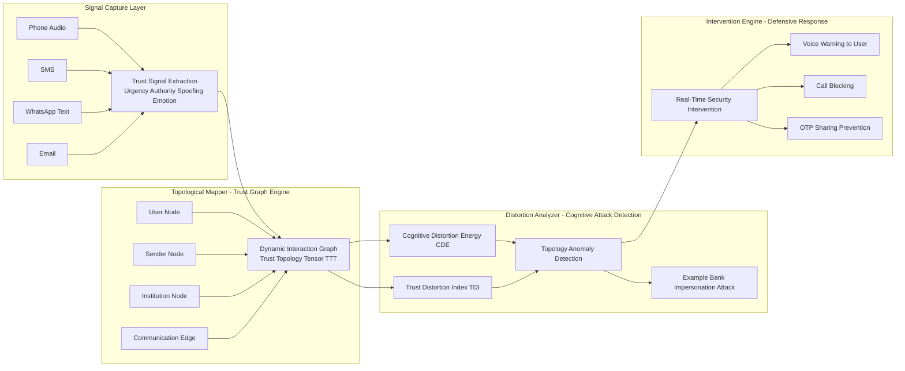

## **CAT Architecture**

```mermaid
graph LR
    %% SIGNAL CAPTURE LAYER
    subgraph L1["Signal Capture Layer"]
        A1[" Phone Audio"]
        A2[" SMS"]
        A3[" WhatsApp Text"]
        A4[" Email"]
        A5[" Trust Signal Extraction<br/>Urgency Authority Spoofing Emotion"]
    end

    A1 --> A5
    A2 --> A5
    A3 --> A5
    A4 --> A5

    %% TOPOLOGICAL MAPPER
    subgraph L2["Topological Mapper - Trust Graph Engine"]
        B1[" User Node"]
        B2[" Sender Node"]
        B3[" Institution Node"]
        B4[" Communication Edge"]
        B5[" Dynamic Interaction Graph<br/>Trust Topology Tensor TTT"]
    end

    A5 --> B5
    B1 --> B5
    B2 --> B5
    B3 --> B5
    B4 --> B5

    %% DISTORTION ANALYZER
    subgraph L3["Distortion Analyzer - Cognitive Attack Detection"]
        C1[" Cognitive Distortion Energy CDE"]
        C2[" Trust Distortion Index TDI"]
        C3[" Topology Anomaly Detection"]
        C4[" Example Bank Impersonation Attack"]
    end

    B5 --> C1
    B5 --> C2
    C1 --> C3
    C2 --> C3
    C3 --> C4

    %% INTERVENTION ENGINE
    subgraph L4["Intervention Engine - Defensive Response"]
        D1[" Voice Warning to User"]
        D2[" Call Blocking"]
        D3[" OTP Sharing Prevention"]
        D4[" Real-Time Security Intervention"]
    end

    C3 --> D4
    D4 --> D1
    D4 --> D2
    D4 --> D3


    class A1,A2,A3,A4 input
    class A5,B1,B2,B3,B4,B5 process
    class C1,C2,C3,C4 analysis
    class D1,D2,D3,D4 output
```
